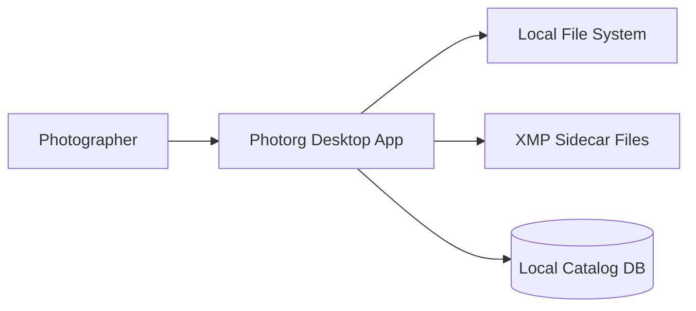
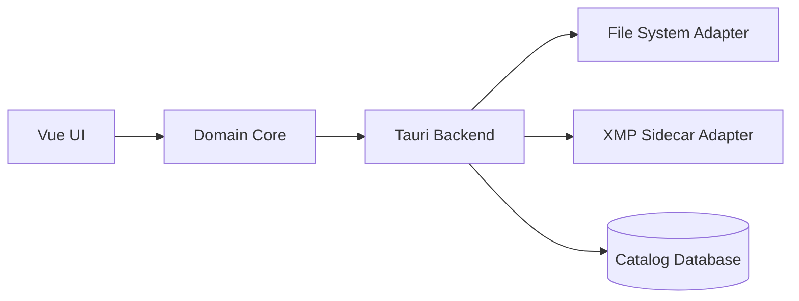

# Photorg Architecture

## System Context (C4 - Level 1)

## Container View (C4 - Level 2)

## Component Notes

- **Domain Core** owns pairing, culling state, rater logic, and conflict policy.
- **XMP Sidecar Adapter** writes interoperable outcomes (`xmp:Rating`, `xmp:Label`) only.
- **Catalog Database** stores operational internals (pairwise comparisons, confidence, session history).
- **File System Adapter** enforces immutable-source policy by default.
