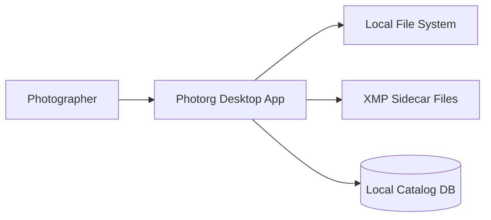
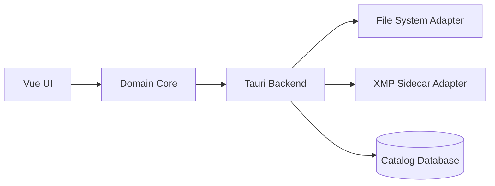

# Photorg Architecture

## Vertical Slice Architecture (VSA)

Photorg uses Vertical Slice Architecture to organize code by business capability. This ensures clean separation between shared infrastructure and feature-specific logic.

### Directory Structure

```
src-tauri/src/
  infrastructure/          # Shared infrastructure (cross-cutting concerns)
    error/                # Error abstraction, codes, categories
    logging/              # Structured logging setup
    audit/                # Append-only audit trail
  
  features/               # Feature vertical slices
    error_display/        # Error UI display and handling

src/
  features/
    error_display/        # Frontend error display
      components/         # Vue components (GenericDialog)
      composables/        # Vue composables (useErrorHandler)
      types.ts            # Frontend error DTOs
      index.ts            # Public API
```

### SOLID Principles Applied

| Principle | Implementation |
|-----------|---|
| **S**ingle Responsibility | Each module has one reason to change: error types, logging setup, audit logging, error display |
| **O**pen/Closed | Error categories extensible via `ErrorCode` enum; generic dialog component reusable |
| **L**iskov Substitution | All errors follow consistent `ErrorDetails` contract |
| **I**nterface Segregation | Features import only public types from infrastructure |
| **D**ependency Inversion | Features depend on infrastructure abstractions, never vice versa |

### Error Handling Architecture

```
Backend Error Creation
    ↓
Error Categorization (auto via ErrorCode)
    ↓
Logging (JSON to app.log)
    ↓
Frontend receives ErrorDetails
    ↓
useErrorHandler formats for UI
    ↓
GenericDialog displays based on category
```

## System Context (C4 - Level 1)



## Container View (C4 - Level 2)



## Component Notes

- **Domain Core** owns pairing, culling state, rater logic, and conflict policy.
- **XMP Sidecar Adapter** writes interoperable outcomes (`xmp:Rating`, `xmp:Label`) only.
- **Catalog Database** stores operational internals (pairwise comparisons, confidence, session history).
- **File System Adapter** enforces immutable-source policy by default.
- **Error Infrastructure** (new) provides structured error handling, categorization, and logging across all features.
- **Audit Infrastructure** (new) maintains immutable decision trail for compliance and debugging.

