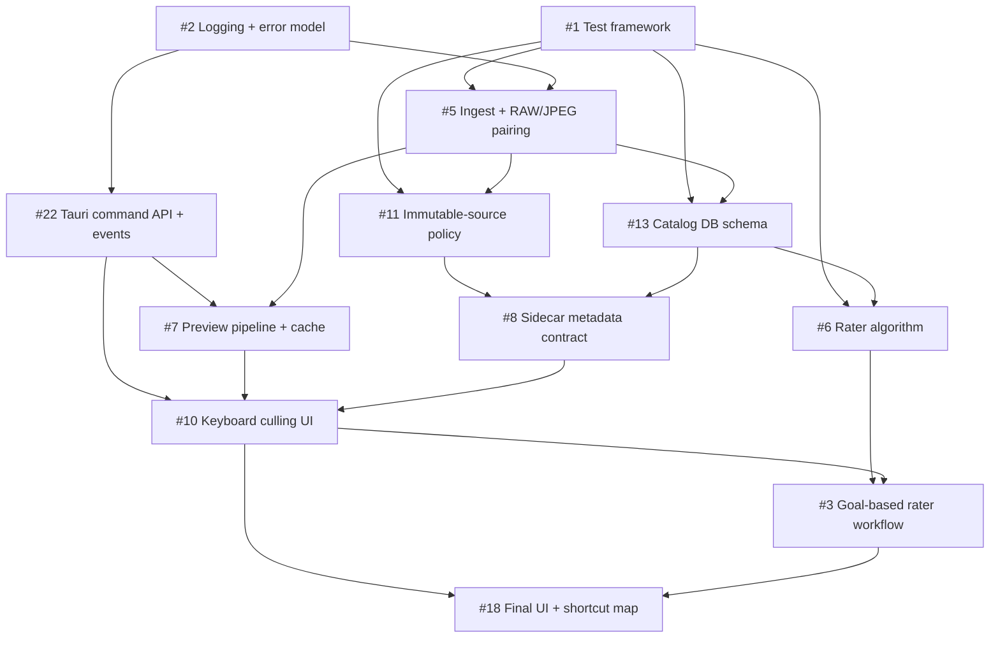

# Photorg MVP Scope (Phase 1)

- **Status:** Locked
- **Phase:** 1 (MVP)
- **Owner:** @kevingvand
- **Related ADRs:** [ADR-001](./DECISIONS.md#adr-001-immutable-source-files-by-default), [ADR-002](./DECISIONS.md#adr-002-sidecar--db-metadata-split), [ADR-003](./DECISIONS.md#adr-003-keyboard-first-culling-workflow), [ADR-004](./DECISIONS.md#adr-004-mvp-scope-locked-to-phase-1)

This document is the authoritative scope boundary for Photorg's first shippable release. Anything not listed under **Must-have features** is out of scope for MVP. Disagreements should be resolved by amending this document via PR, not by widening scope inside feature issues.

## Single-user assumption

MVP is **single-user, single-machine, single-catalog, single-directory** per session. There is no multi-user concurrency, no shared catalog, no networked sync, and no cross-device session continuity. Concurrency-safe design work is explicitly deferred so it does not block Phase 1.

## Must-have features

Each must-have feature maps to one or more existing tracking issues. Phase 1 is complete when every issue listed here is closed and the success metrics below are met.

| Capability | Issue(s) | Notes |
| --- | --- | --- |
| Unit + integration test framework in place | [#1](https://github.com/kevingvand/photorg/issues/1) | Foundation — must land first |
| Logging + error reporting model | [#2](https://github.com/kevingvand/photorg/issues/2) | Required for diagnosability of all later work |
| Image ingest pipeline with RAW+JPEG pairing | [#5](https://github.com/kevingvand/photorg/issues/5) | Treats each pair as one logical unit |
| Preview pipeline with thumbnail caching + lazy loading | [#7](https://github.com/kevingvand/photorg/issues/7) | Drives the <100ms preview target |
| Sidecar metadata contract (XMP Rating/Label) | [#8](https://github.com/kevingvand/photorg/issues/8) | Per ADR-002, interoperable outcomes only |
| Keyboard-driven culling UI + shortcut bindings | [#10](https://github.com/kevingvand/photorg/issues/10) | Per ADR-003, primary interaction model |
| Immutable-source enforcement policy + tests | [#11](https://github.com/kevingvand/photorg/issues/11) | Per ADR-001, must be enforced and tested |
| Catalog DB schema + conflict resolution rules | [#13](https://github.com/kevingvand/photorg/issues/13) | Operational internals only (see ADR-002) |
| Finalized culling UI design + shortcuts | [#18](https://github.com/kevingvand/photorg/issues/18) | Locks the keyboard map before release |
| Tauri command API + event model | [#22](https://github.com/kevingvand/photorg/issues/22) | Stable contract between Vue UI and Rust core |
| Rater algorithm + pairwise comparison model | [#6](https://github.com/kevingvand/photorg/issues/6) | Backs the goal-based selection workflow |
| Goal-based comparison rater (2/3/4-image rounds) | [#3](https://github.com/kevingvand/photorg/issues/3) | Tournament-style best-shot selection |

## Non-features (deferred)

These are tracked but explicitly **out of scope for MVP**. Pull requests that implement these against the Phase 1 milestone will be rejected.

| Excluded capability | Issue | Why deferred |
| --- | --- | --- |
| Conflict detection + resolution workflow | [#4](https://github.com/kevingvand/photorg/issues/4) | Conflict policy lives in core (#13); full UX workflow is post-MVP |
| Export/sync to external formats beyond XMP | [#12](https://github.com/kevingvand/photorg/issues/12) | XMP sidecar is the only required interop surface for MVP |
| Library view with label/tag management | [#14](https://github.com/kevingvand/photorg/issues/14) | MVP is culling-first; library browsing is post-MVP |
| Broad end-to-end workflow test suite | [#15](https://github.com/kevingvand/photorg/issues/15) | One happy-path e2e smoke in MVP (see test strategy); full suite deferred |
| Settings / preferences UI | [#16](https://github.com/kevingvand/photorg/issues/16) | MVP ships with sensible defaults; configurable UI is post-MVP |
| Performance profiling tooling | [#17](https://github.com/kevingvand/photorg/issues/17) | Metrics validated ad hoc for MVP; permanent tooling is post-MVP |
| CI/CD pipeline + automated releases | [#19](https://github.com/kevingvand/photorg/issues/19) | Manual release for MVP; automation is post-MVP |
| Multi-catalog support | [#20](https://github.com/kevingvand/photorg/issues/20) | Single-catalog assumption is explicit (see above) |
| User documentation + help guides | [#21](https://github.com/kevingvand/photorg/issues/21) | README + DECISIONS.md only for MVP |
| Database backup + migration system | [#23](https://github.com/kevingvand/photorg/issues/23) | Schema is allowed to change without migrations during MVP |

### Other explicit non-goals
- Cloud sync of catalog, sidecars, or previews
- Plugin / extension ecosystem
- Advanced color correction, develop module, or destructive edits of any kind
- Multi-user concurrency, shared catalogs, networked operation
- Mobile or web clients
- AI-assisted automatic culling (separate from the deterministic rater in #3/#6)

## Success metrics

Phase 1 is considered "done" only when **all** of the following are demonstrably met on a reference machine (modern SSD, 16 GB RAM):

- **Cull throughput:** review 1000 paired photos/hour with keyboard-only flow
- **Preview load:** <100 ms median for cached preview, <500 ms cold
- **Pairing accuracy:** ≥99% on standard RAW+JPEG naming conventions
- **Cold-start ingest:** 1000 image pairs scanned in <30 s
- **Source immutability:** zero source-file mutations across a 1000-image session (validated by hash comparison)

## Test coverage strategy

| Layer | Scope in MVP | Owning issue |
| --- | --- | --- |
| **Unit** | Domain core: pairing logic, culling state machine, immutable-source policy, rater algorithm (#6) | #1 |
| **Integration** | FS adapter, XMP sidecar adapter, catalog DB adapter — each tested against a real filesystem + SQLite instance | #1 |
| **End-to-end** | Exactly one happy-path smoke: ingest a folder → cull with keyboard → write XMP sidecars → verify outcomes. Broader e2e is deferred to #15. | #15 (partial) |

Coverage is judged on behavior, not line percentage. There is no minimum coverage threshold for MVP; instead, every must-have capability above must ship with at least one behavioral test at the appropriate layer.

## Phase 1 dependency chain

### Critical path
`#1 → #5 → #13 → #8 → #10 → #18` is the minimum sequence that unblocks a shippable cull-and-write loop. Rater (#6 → #3) joins back into #18 before release lock.

## Amending this document

This scope is locked. Changes require:
1. A PR that updates this file
2. Linked rationale in the PR description
3. A corresponding ADR entry in `docs/DECISIONS.md` if the change alters an architectural assumption (single-user, immutable source, sidecar/DB split, keyboard-first)
